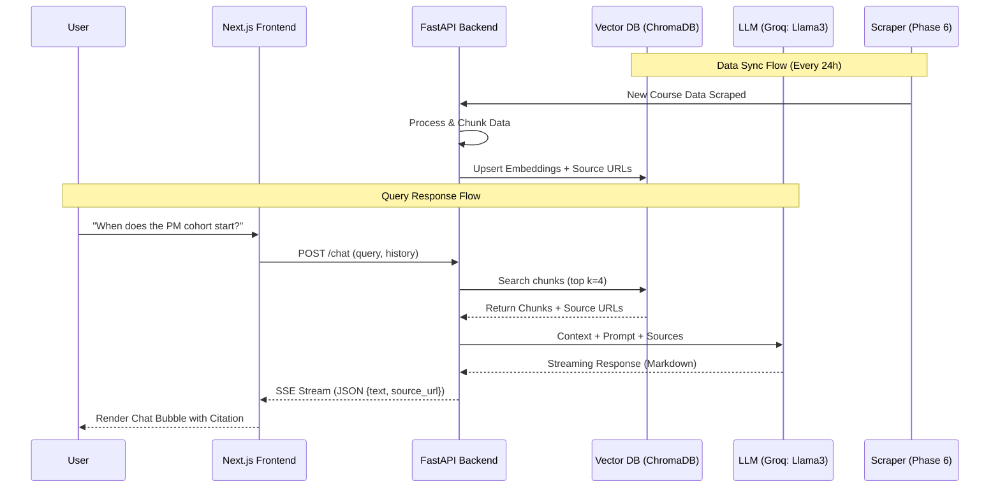

# NextLeap RAG Chatbot: Detailed Technical Architecture & Implementation Plan

This document provides a deep-dive into the technical flow, implementation strategies, and system constraints for the NextLeap RAG Chatbot.

---

## 🏗️ 1. System High-Level Architecture & Flow

The system follows a modular RAG pattern, separating data ingestion from user interaction.

### 🔄 End-to-End Data Flow

---

## 📅 2. Implementation Phases

### Phase 1: Knowledge Acquisition (Status: COMPLETE)
*   **Implementation**: Scripted scraping of `nextleap.app/course/*`.
*   **Key Logic**: Carousel extraction to find all hidden instructors from companies like Microsoft, Meta, and Flipkart.
*   **Output**: Structured `raw_nextleap_data.json` and human-readable `phase1_data.md`.

### Phase 2: Embedding & Multi-Index Strategy
*   **Chunking Logic**: 
    - **Header-Aware**: Splitting by Markdown headers to keep "Course Outcomes" separate from "Syllabus".
    - **Metadata Enrichment**: Each chunk stores `{source_url: str, cohort: str, type: str, timestamp: str}`.
*   **Vector DB**: Initial implementation using **ChromaDB** with HNSW (Hierarchical Navigable Small World) for sub-second retrieval.

### Phase 3: Advanced Retrieval Logic
*   **Hybrid Search Implementation**:
    - **Dense (Vector)**: Conceptual matching (e.g., "AI career help").
    - **Sparse (BM25)**: Exact term matching (e.g., "Product Manager Fellowship").
*   **Re-ranking**: Post-retrieval ranking to ensure the most specific deadline or course detail is prioritized.

### Phase 4: Generation & LLM Integration
*   **LLM Provider**: **Groq** (using Llama 3 models) for ultra-fast inference and streaming.
*   **Strict Grounding Mechanism (Knowledge Lock)**:
    - **Distance Filter**: Retriever uses a similarity threshold (default 1.1) to reject chunks that are not closely related to NextLeap.
    - **Instant Bail-out**: If no relevant facts are retrieved from the knowledge base, the system returns a friendly "not found" response *without* calling the LLM. 
    - **System Prompt Identity**: The AI is instructed that its "sole memory of the world" is the provided [Context] from our database. It is strictly forbidden from using its own pre-trained information about other topics.
    - **Personal Info Gate**: If a user asks for personal/sensitive data (emails, salaries of specific individuals not in the public list), the system must explicitly refuse.
    - **Source Handling**: "You must append the source_url to the end of every answer if retrieved."

### Phase 5: Application Development
*   **Backend (FastAPI)**:
    - `POST /v1/chat`: Main endpoint for streaming.
    - `GET /v1/history`: Retrieve past messages for session continuity.
*   **Frontend (Next.js)**:
    - **State Management**: React Context or Zustand for chat state.
    - **Theme**: Dark-mode first with "NextLeap Blue" accents (#0066FF).
    - **Components**: `ChatBubble`, `SourceLink`, `TypingIndicator`, `CohortSelector`.

---

## 🔄 3. Automated Synchronization (Phase 6 Implementation)

To handle the **March 8th Price Hike** and changing cohort dates automatically:

1.  **Trigger**: CRON job via GitHub Actions.
2.  **Diff Checker**: Compare the MD5 hash of the new site crawl vs the current DB record.
3.  **Soft Update**: If only the price changed, update the metadata without re-calculating embeddings for the entire curriculum.

---

## 🛠️ 4. Technical Implementation Stack

| Layer | Component | Implementation Detail |
| :--- | :--- | :--- |
| **Data Extraction** | Scraper | BeautifulSoup4 / Playwright (for dynamic content) |
| **Process Logic** | LangChain | Custom `RecursiveCharacterTextSplitter` |
| **Embeddings** | OpenAI | `text-embedding-3-small` |
| **LLM Provider** | **Groq Cloud** | High-speed Llama 3 (70B/8B) inference |
| **Vector Index** | ChromaDB | Persistent local storage for prototyping |
| **API Backend** | FastAPI | Pydantic models for request/response validation |
| **Database** | Redis | Ephemeral storage for user sessions |
| **Frontend** | Next.js | Tailwind CSS + Lucide Icons |

---

## 🛡️ 5. Constraints & Error Handling

| Scenario | System Behavior |
| :--- | :--- |
| **Site Down** | Use cached knowledge from last successful sync; log warning. |
| **Grounding Failure** | **DO NOT ANSWER.** If similarity score < 0.70, state that information is unavailable. |
| **Personal/PII Query** | Refuse to answer. "I cannot provide personal information for privacy reasons." |
| **Out of Scope** | Anything unrelated to NextLeap fellowships: "I can only help with NextLeap course inquiries." |
| **Missing Content** | Provide a graceful fallback: "I don't have that detail yet, please visit [nextleap.app](https://nextleap.app)." |
| **Rate Limit** | Return 429 Error with user-friendly "Please try again in 5 minutes." |
