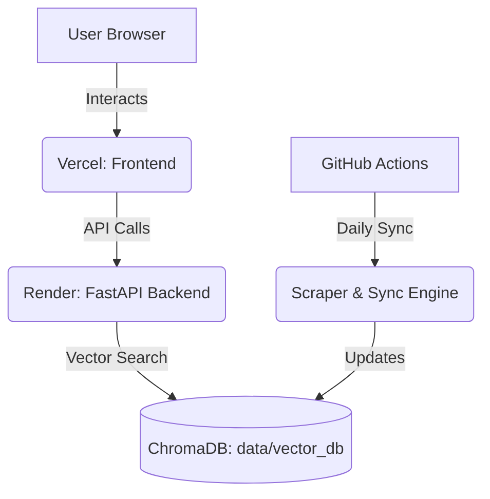

# 🚀 Deployment Guide: NextLeap RAG Chatbot

This guide outlines the steps to deploy your full-stack RAG application.

## 1. Backend (FastAPI) - Deploy on [Render](https://render.com) or [Railway](https://railway.app)
Since your backend is built with FastAPI, you need a Python-friendly hosting provider.

> [!NOTE]
> You mentioned "backend in Streamlit". Since we already have a powerful Next.js frontend, it is highly recommended to deploy the existing **FastAPI** backend to serve the API. If you wish to switch entirely to Streamlit, we would need to merge the logic and UI into a single Python file.

### Option A: Render/Railway (Standard FastAPI)
1. **Create Account**: Sign up at [render.com](https://render.com).
2. **New Web Service**: Connect your GitHub repository.
3. **Configure**:
   - **Runtime**: `Python 3`
   - **Build Command**: `pip install -r requirements.txt`
   - **Start Command**: `uvicorn src.phase5_backend.main:app --host 0.0.0.0 --port $PORT`
4. **Environment Variables**: Add `OPENAI_API_KEY`, `GROQ_API_KEY`, and `PYTHONPATH=.`.

### Option B: Streamlit Cloud (Easiest)
If you want to use the **Streamlit** version I just created:
1. **Create Account**: Sign up at [share.streamlit.io](https://share.streamlit.io).
2. **New App**: Connect your GitHub repo.
3. **Main File**: Set to `streamlit_app.py`.
4. **Secrets**: Add your API keys in the app settings (Secrets section).

---

## 2. Frontend (Next.js) - Deploy on [Vercel](https://vercel.com)
Vercel is the native platform for Next.js and offers the best performance.

### Steps:
1. **Create Account**: Sign up at [vercel.com](https://vercel.com).
2. **Import Project**: Select your GitHub repo.
3. **Root Directory**: Set this to `src/phase5_frontend`.
4. **Environment Variables**:
   - `NEXT_PUBLIC_BACKEND_URL`: Set this to your **Render/Railway backend URL** (e.g., `https://your-api.onrender.com`).
5. **Deploy**: Click "Deploy".

---

## 3. Scheduler & Knowledge Base - [GitHub Actions]
Phase 6 is already configured! You just need to enable permissions.

### Steps:
1. **GitHub Repository Settings**:
   - Go to **Settings > Secrets and variables > Actions**.
   - Add **New repository secret**:
     - `OPENAI_API_KEY`
     - `GROQ_API_KEY`
2. **Enable Workflow Permissions**:
   - Go to **Settings > Actions > General**.
   - Under **Workflow permissions**, select **"Read and write permissions"** (This allows the scheduler to push the updated `data/vector_db` back to your repo).
3. **Trigger Manually**: 
   - Go to the **Actions** tab in GitHub.
   - Select **"Daily NextLeap Sync"**.
   - Click **Run workflow** to test the sync immediately.

---

## 🗺️ Architecture Overview

